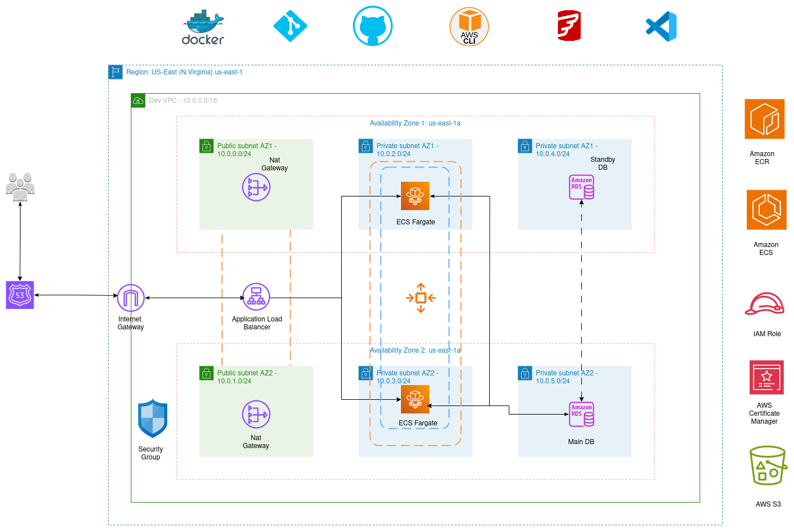

# CI/CD USING GitHub Actions, Terraform, AND ECS TO DEPLOY Laravel-Project

In this cap stone project, I deployed a dynamic car rental web application called Rentzone in AWS using GitHub Actions CI/CD pipelines and Terraform for infrastructure deployment.

